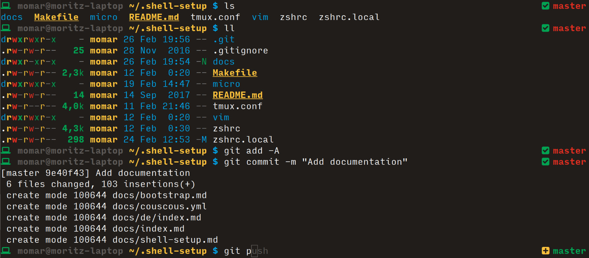
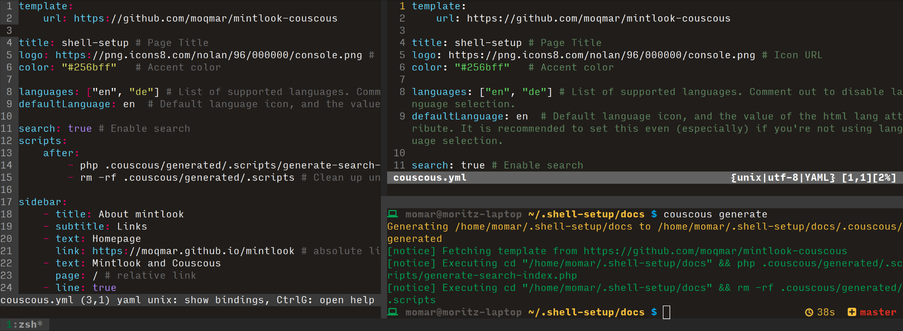

# What is shell-setup?

This is basically a repository of all the dotfiles that make up my console configuration.  
There's also the [bootstrap.sh](https://gist.github.com/moqmar/7b468d995619131e983d59bde253d9a0) script that sets up a fully functional Debian server as I like it.

So, this is all highly opinionated. I like simplicity, saving space and ease of use (from a GNOME user's perspective, I know that if your desktop environment is Emacs you'll find something different to be easy to use).

If you like that too, that's great, but you might want to [fork the repository](https://github.com/moqmar/shell-setup#fork-destination-box) and make your own version. The goal is not just to share my configuration, it's more about providing a workflow to quickly appy a configuration to a new system.

## User configuration

The configuration currently works for:
- **zsh**: An awesome bash replacement with a lot of great plugins available.
- **tmux**: A terminal multiplexer.
- **vim**: An advanced command line text editor that's available on pretty much every system.
- **micro**: A tiny command line text editor with intuitive controls (mouse, Ctrl+S, ...).
- **ssh**: Generates an SSH key and sets up folder permissions.





### Manually applying the configuration

```bash
$ git clone https://github.com/moqmar/shell-setup.git ~/.shell-setup
$ cd .shell-setup
$ make install
```

See the [advanced documentation page](/shell-setup.html) for more information about applying and modifiying the configuration.

## The `bootstrap` script

The script can currently set up the following (it will ask for every step before running it):
- **locales**: Choose the correct locale settings for the server.
- **apt: upgrade**: Update package lists and upgrade all packages to the latest version.
- **apt: install basic tools**: vim, git, build-essential, zip/unzip, tar, htop, wget, curl, dnsutils
- **apt: install additional tools**: zsh, tmux, mosh, ag, jq
- **install binary tools**: micro, exa, fd
- **user configuration**: Apply shell-setup for the current user.
- **default for new users**: Apply shell-setup for all new users.
- **clear motd, colored bash prompt**
- **sshd config**: Don't allow password authentication and use simple `/etc/ssh/sshd_config`.
- **quad9 nameserver**
- **basic iptables ruleset**: Allow SSH, Mosh and networking-relevant protocols (ping, traceroute, dhcp)
- **caddy**: Easy-to-use webserver, can be optionally installed together with PHP.

There's a [detailed bootstrap.sh documentation page](/bootstrap.html) available containing more information about what changes every one of the steps makes to a system.

### Using the bootstrap script

```bash
$ bash -c ". <(curl -s https://gist.githubusercontent.com/moqmar/7b468d995619131e983d59bde253d9a0/raw)"
```
